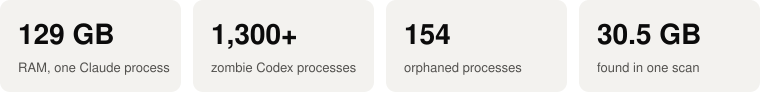
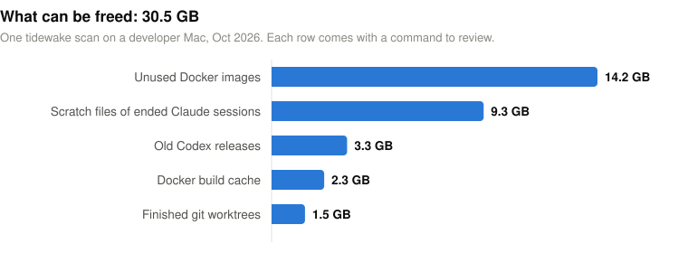
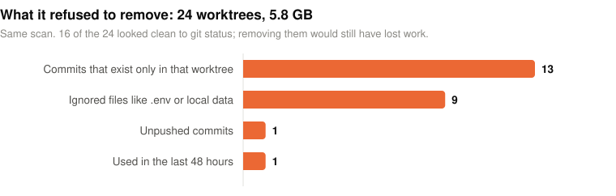
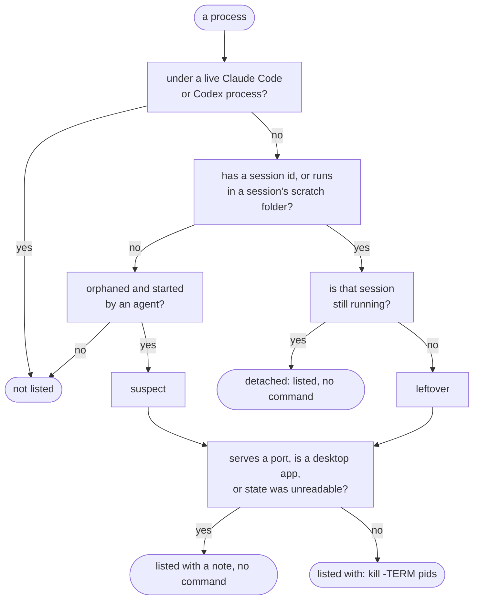

# tidewake

[](https://github.com/berkkorkmaz/tidewake/actions/workflows/ci.yml)
[](https://github.com/berkkorkmaz/tidewake/releases)
[](LICENSE)

**See what your coding agents left behind, and whether it is safe to remove.**

Claude Code and Codex start servers, browsers, test runners and worktrees for you. When a session
crashes or ends, some of that keeps running and keeps filling your disk. tidewake finds it, ties
every item to the session that created it, and shows the proof. It never deletes anything itself:
each row ends with the command to run if you agree.

<picture>
  <source media="(prefers-color-scheme: dark)" srcset="docs/img/summary-dark.svg">
  
</picture>

## Try it

```sh
brew install --cask berkkorkmaz/tap/tidewake
tidewake scan        # what was left behind, with proof and a command per row
tidewake sessions    # live sessions: memory, CPU, and which one looks stuck
tidewake doctor      # your Claude Code / Codex versions against known leak fixes
```

macOS for now (Apple Silicon and Intel). With Go 1.27+: `go install github.com/berkkorkmaz/tidewake/cmd/tidewake@latest`.

## What it found on one Mac

<picture>
  <source media="(prefers-color-scheme: dark)" srcset="docs/img/freed-dark.svg">
  
</picture>

Being careful matters as much as finding things. In the same scan, tidewake refused to remove 24
worktrees whose `git status` looked clean:

<picture>
  <source media="(prefers-color-scheme: dark)" srcset="docs/img/kept-dark.svg">
  
</picture>

The figures come from one `tidewake scan` run in October 2026; [`scripts/readme_charts.py`](scripts/readme_charts.py)
holds the numbers and redraws the charts.

## Every row shows its proof

Real rows from the same Mac, trimmed:

```
leftover claude b7ec50d0   pid 77162   5d   426 kB  tail -n +1 -f /private/tmp/claude-501/…/b4.output
         why:  runs in session b7ec50d0's scratch directory; no running Claude Code session has this id;
               no Claude Code process above it (parent: launchd)
         run:  kill -TERM 77162

leftover claude a34ed489   pid 46142  10d   262 MB  postgres -D /opt/homebrew/var/postgresql@17  [:5432]
         why:  carries CLAUDE_CODE_SESSION_ID=a34ed489; no running Claude Code session has this id;
               no Claude Code process above it (parent: launchd)
         note: serves :5432; it may be a service you use. If not: kill -TERM 46142 5573 4969 …

claude pid 57616   4e206b9e leus-dbt-76   busy   3d   21 MB   0%   last activity 3d ago
         Looks stuck: busy for 3d with no activity
           why: status "busy" since Sep 29 11:45; no transcript write for 3d; 0.0% CPU over 3s
           tip: check its terminal; Esc stops the current turn
```

The first row gets a command. The second does not: it is a database, and tidewake will not guess
that you are done with it. The third comes from `tidewake sessions`.

## How it decides



**Processes.** Claude Code and Codex give every child process its session id
(`CLAUDE_CODE_SESSION_ID`, `CODEX_THREAD_ID`). tidewake reads only those allow-listed variables,
never tokens, and checks the session against each tool's own state (`claude agents --json`,
`~/.claude/sessions/`, Codex's thread database). A reused PID never counts as alive: start times
must match. A row's kill list stops at anything that belongs elsewhere (a live session, another
session, a launchd service, the shell you ran tidewake from) and says how many it left out.

**Worktrees.** A worktree is `removable` only when every check passes:

| Check | Why |
|---|---|
| not locked, no process running inside it | an agent may still be using it |
| no uncommitted or untracked files | that is work |
| no ignored files outside rebuildable folders | `git worktree remove` deletes ignored files too, such as `.env` |
| HEAD is on a remote, and every commit made there is on some branch, tag or remote | removing a worktree deletes its reflog, the last pointer to commits left behind |
| untouched for 48 hours (`--idle`) | recent work may be in progress |

Rebuildable folders (`node_modules`, `.venv`, `target`, `.terraform`, `dbt_packages` and similar) do
not block removal.

**Disk.** Old Codex releases that are neither current nor running, Docker images and build cache
(week-old or size-budget prune commands), and scratch folders of ended Claude sessions. Stopped
containers and volumes are listed for review only, because both can hold data.

## Session health

`tidewake sessions` shows each live Claude Code session and top-level Codex process with its memory
(including MCP servers and shells under it), CPU over a 3-second sample, and when its transcript was
last written. It reads file times only, never transcript contents. A flag needs every signal:

| Flag | Signals |
|---|---|
| looks stuck | `busy` for 2h+, no transcript write for 2h+, under 1% CPU |
| idle, holding memory | `idle`, no transcript write for 24h+, 1 GB+ in its process tree |
| CPU while idle | `idle` for 5m+, 50%+ CPU |
| high memory | 4 GB+ in its process tree, with the largest part named |

A healthy busy session can go half an hour without writing, so the limits are in hours. Change them
with `--stuck`, `--idle` and `--ram`.

## Safe by design

- **Read-only.** No command stops a process or deletes a file. `--json` output is available for scripts.
- **No network.** Nothing is sent anywhere.
- **No downloads from iCloud.** If your repos live in an iCloud-synced folder, tidewake's git checks
  do not re-read offloaded files, so a scan never triggers a download.
- **Fast.** 3 to 7 seconds on the Macs tested so far; about 10 s on one with half a million scratch
  files. Set `TIDEWAKE_DEBUG=1` to see timings.

## Keeps up with Claude Code and Codex

Everything that changes between releases lives in [`internal/rules/pack.json`](internal/rules/pack.json):
process signatures, state paths, and known leaks with the version that fixed them. A daily workflow
reads the Claude Code changelog and Codex releases and opens a pull request with new lines about
leaks, orphans, worktrees and cleanup. A person reviews each one. `tidewake doctor` then tells you
which known leaks affect the versions you are running.

## Compared with

| Tool | Focus | Difference |
|---|---|---|
| worktrunk, Claude Code / Codex built-in cleanup | worktrees they created | tidewake reads across all of them and checks ignored files and reflog-only commits |
| abtop | live monitor of agent sessions | tidewake is a one-shot audit with proof per row |
| Mole, npkill, kondo | general disk cleaning | they do not know which agent session made what |
| ccusage | tokens and cost | not covered here |

## Roadmap

1. `tidewake clean`: run the rows you pick, with a preview, a receipt, and undo for worktrees.
2. Context audit: what instructions, rules, skills and MCP servers load before you type, including
   Codex silently cutting `AGENTS.md` at 32 KB ([codex#13386](https://github.com/openai/codex/issues/13386)).
3. Linux.

## License

MIT
