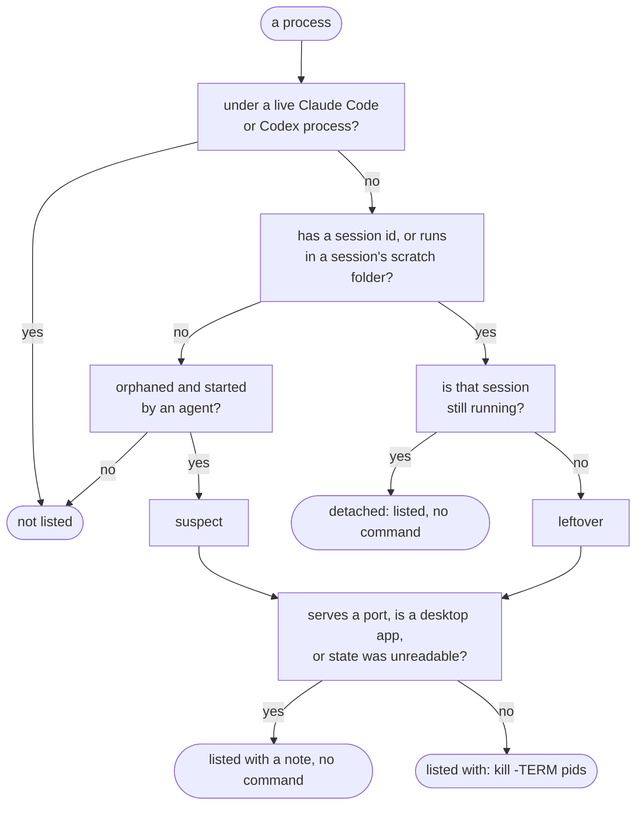

# How tidewake works

The README keeps it short; this page has every rule. tidewake is read-only: it never stops a process
or deletes a file, and every command it prints is for you to review and run.

## How it decides

**Processes.** Claude Code and Codex give every child process its session id
(`CLAUDE_CODE_SESSION_ID`, `CODEX_THREAD_ID`). tidewake reads only those allow-listed variables,
never tokens, and checks the session against each tool's own state (`claude agents --json`,
`~/.claude/sessions/`, Codex's thread database). A reused PID never counts as alive: start times
must match. A row's kill list stops at anything that belongs elsewhere (a live session, another
session, a launchd service, the shell you ran tidewake from) and says how many it left out.

**Worktrees.** A worktree is `removable` only when every check passes:

<picture>
  <source media="(prefers-color-scheme: dark)" srcset="img/kept-dark.svg">
  
</picture>

| Check | Why |
|---|---|
| not locked, no process running inside it | an agent may still be using it |
| no uncommitted or untracked files | that is work |
| no ignored files outside rebuildable folders | `git worktree remove` deletes ignored files too, such as `.env` |
| HEAD is on a remote, and every commit made there is on some branch, tag or remote | removing a worktree deletes its reflog, the last pointer to commits left behind |
| untouched for 48 hours (`--idle`) | recent work may be in progress |

Rebuildable folders (`node_modules`, `.venv`, `target`, `.terraform`, `dbt_packages` and similar) do
not block removal.

**Disk.** Old Codex releases that are neither current nor running, Docker images and build cache
(week-old or size-budget prune commands), and scratch folders of ended Claude sessions. Stopped
containers and volumes are listed for review only, because both can hold data.

## Session health

`tidewake sessions` shows each live Claude Code session and top-level Codex process with its memory
(including MCP servers and shells under it), CPU over a 3-second sample, and when its transcript was
last written. It reads file times only, never transcript contents. A flag needs every signal:

| Flag | Signals |
|---|---|
| looks stuck | `busy` for 2h+, no transcript write for 2h+, under 1% CPU |
| idle, holding memory | `idle`, no transcript write for 24h+, 1 GB+ in its process tree |
| CPU while idle | `idle` for 5m+, 50%+ CPU |
| high memory | 4 GB+ in its process tree, with the largest part named |

A healthy busy session can go half an hour without writing, so the limits are in hours. Change them
with `--stuck`, `--idle` and `--ram`.

## Safe by design

- **Read-only.** No command stops a process or deletes a file. `--json` output is available for scripts.
- **No network.** Nothing is sent anywhere.
- **No downloads from iCloud.** If your repos live in an iCloud-synced folder, tidewake's git checks
  do not re-read offloaded files, so a scan never triggers a download.
- **Fast.** 3 to 7 seconds on the Macs tested so far; about 10 s on one with half a million scratch
  files. Set `TIDEWAKE_DEBUG=1` to see timings.

## Keeps up with Claude Code and Codex

Everything that changes between releases lives in [`internal/rules/pack.json`](internal/rules/pack.json):
process signatures, state paths, and known leaks with the version that fixed them. A daily workflow
reads the Claude Code changelog and Codex releases and opens a pull request with new lines about
leaks, orphans, worktrees and cleanup. A person reviews each one. `tidewake doctor` then tells you
which known leaks affect the versions you are running.

## Compared with

| Tool | Focus | Difference |
|---|---|---|
| worktrunk, Claude Code / Codex built-in cleanup | worktrees they created | tidewake reads across all of them and checks ignored files and reflog-only commits |
| abtop | live monitor of agent sessions | tidewake is a one-shot audit with proof per row |
| Mole, npkill, kondo | general disk cleaning | they do not know which agent session made what |
| ccusage | tokens and cost | not covered here |
